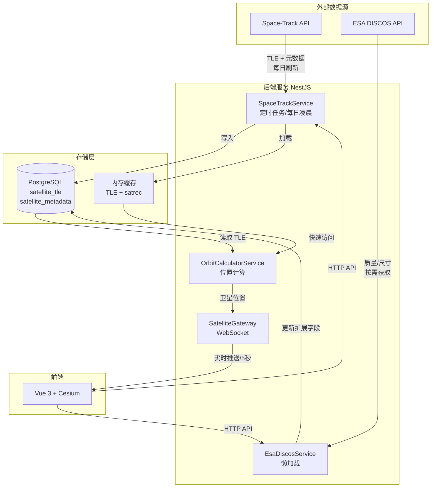
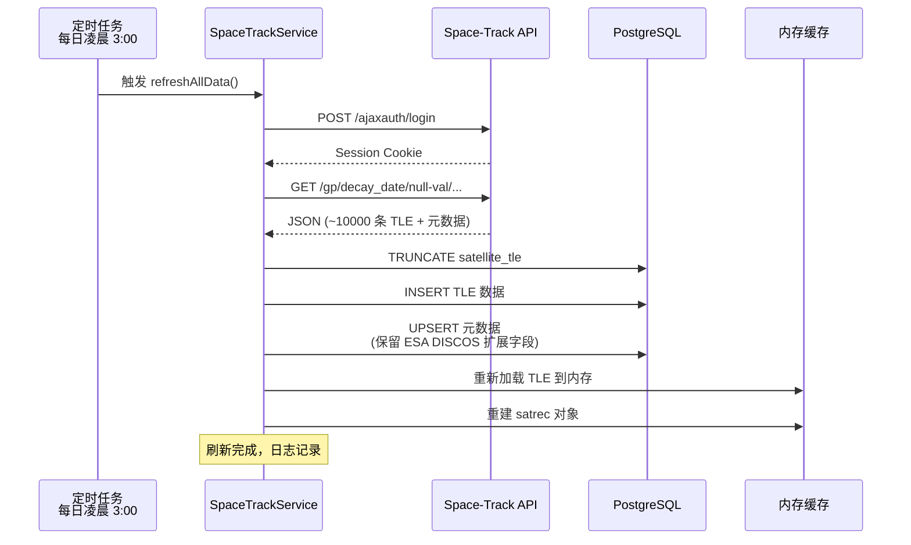
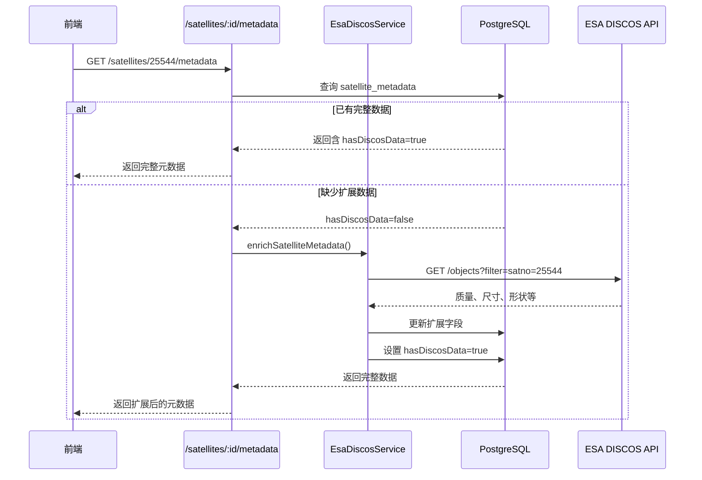
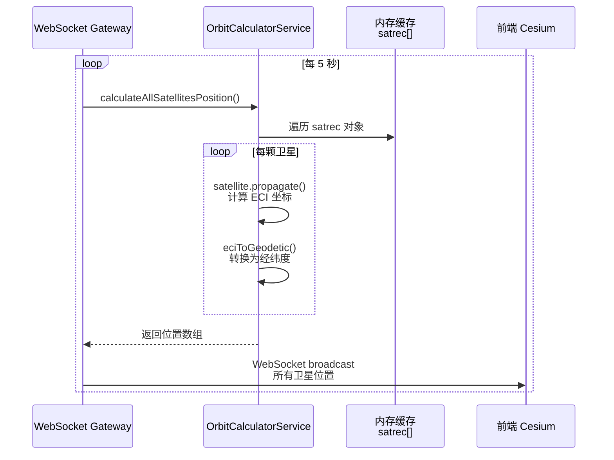
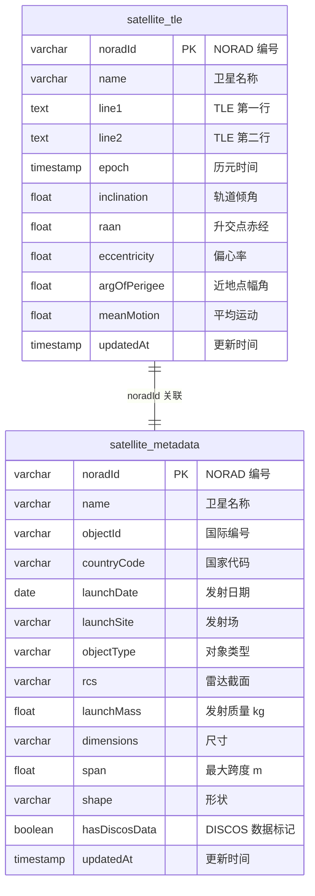

# 卫星数据源方案：Space-Track + ESA DISCOS

> 本文档总结 Nova Space 项目的卫星数据获取策略、API 使用规范和数据库存储方案。

---

## 概述

### 问题背景

原方案使用 CelesTrak GP 端点获取 TLE 数据，但实际测试发现：

- CelesTrak GP 端点**不返回元数据字段**（countryCode、launchDate、launchSite 等）
- 导致 `/api/satellites/countries` 接口返回空数据

### 解决方案

经过实际 API 测试，确定改用 **Space-Track + ESA DISCOS** 组合：

| 数据源 | 用途 | 更新频率 |
|-------|------|---------|
| **Space-Track** | TLE + 基础元数据（国家、发射信息等） | 每日 1 次 |
| **ESA DISCOS** | 扩展元数据（质量、尺寸、形状等） | 懒加载 |
| ~~CelesTrak~~ | 已移除 | - |

---

## 数据流程图

### 整体架构



### 每日数据刷新流程



### 用户访问卫星详情流程



### 实时位置计算流程



### 数据存储关系



---

## Space-Track API

### 基本信息

- **官网**: https://www.space-track.org/
- **认证**: 免费注册，需登录获取 session
- **数据来源**: 18th Space Defense Squadron (18 SDS)

### 认证方式

```bash
# 登录获取 session cookie
POST https://www.space-track.org/ajaxauth/login
Content-Type: application/x-www-form-urlencoded

identity=<username>&password=<password>
```

**示例 (curl)**:
```bash
curl -c cookies.txt -b cookies.txt \
  -X POST "https://www.space-track.org/ajaxauth/login" \
  -d "identity=your@email.com&password=your_password"
```

### 核心 API 端点

#### 获取活跃载荷 TLE（官方推荐）

```
GET /basicspacedata/query/class/gp/OBJECT_TYPE/PAYLOAD/decay_date/null-val/epoch/%3Enow-10/format/json
```

**参数说明**:

| 参数 | 说明 |
|-----|------|
| `class/gp` | General Perturbation 数据类 |
| `OBJECT_TYPE/PAYLOAD` | **只获取有效载荷，排除碎片和火箭体** |
| `decay_date/null-val` | 过滤未衰减的在轨卫星 |
| `epoch/%3Enow-10` | TLE 历元时间在最近 10 天内（保证数据新鲜） |
| `format/json` | JSON 格式输出 |

**数据量对比**:

| 过滤条件 | 数量 | 说明 |
|---------|------|------|
| 无过滤 | ~68,000 | 所有在轨物体（含碎片） |
| `OBJECT_TYPE/PAYLOAD` | **~10,000** | 仅活跃载荷 ✅ |

**URL 编码说明**:
- `%3E` = `>` (大于)
- `%3C` = `<` (小于)

#### 官方文档推荐用法

> "Add `/decay_date/null-val/epoch/%3Enow-10/` to the URL to ensure that you only retrieve propagable ephemerides for on-orbit objects."

### 返回字段（已实际验证）

```json
{
  "OBJECT_NAME": "ISS (ZARYA)",
  "OBJECT_ID": "1998-067A",
  "NORAD_CAT_ID": "25544",
  "EPOCH": "2026-03-24T11:40:14.731104",
  "TLE_LINE0": "0 ISS (ZARYA)",
  "TLE_LINE1": "1 25544U 98067A   26083.48628161  .00013391  00000-0  25488-3 0  9992",
  "TLE_LINE2": "2 25544  51.6345 359.2131 0006234 227.6352 132.4108 15.48523431558623",
  "COUNTRY_CODE": "CIS",
  "LAUNCH_DATE": "1998-11-20",
  "SITE": "TTMTR",
  "OBJECT_TYPE": "PAYLOAD",
  "RCS_SIZE": "LARGE",
  "DECAY_DATE": null,
  "INCLINATION": "51.6345",
  "ECCENTRICITY": "0.00062340",
  "MEAN_MOTION": "15.48523431"
}
```

**字段对照表**:

| 字段 | 说明 | 系统用途 |
|-----|------|---------|
| TLE_LINE1, TLE_LINE2 | TLE 两行轨道根数 | 轨道计算 |
| NORAD_CAT_ID | NORAD 编号 | 主键 |
| OBJECT_NAME | 卫星名称 | 显示 |
| COUNTRY_CODE | 国家代码 ✅ | 国家统计 |
| LAUNCH_DATE | 发射日期 ✅ | 元数据 |
| SITE | 发射场代码 ✅ | 元数据 |
| OBJECT_TYPE | 对象类型 | 筛选 |
| RCS_SIZE | 雷达截面 | 元数据 |
| DECAY_DATE | 衰减日期 | 判断是否在轨 |
| INCLINATION | 轨道倾角 | 轨道参数 |
| ECCENTRICITY | 偏心率 | 轨道参数 |
| MEAN_MOTION | 平均运动 | 轨道参数 |

### API 限制（重要）

| 限制类型 | 值 | 说明 |
|---------|---|------|
| 短期限制 | **< 30 请求/分钟** | 超出会返回错误 |
| 长期限制 | **< 300 请求/小时** | 账户可能被暂停 |
| GP 数据 | **1 次/小时** | 官方建议频率 |
| SATCAT 数据 | **1 次/天** | 每日 17:00 UTC 后获取 |

### 最佳实践

1. **批量获取，避免单条查询**

   > "Do not send hundreds of individual queries to space-track.org with one request per satellite. Instead, use the API as efficiently as possible to minimize the number of requests, combining queries for multiple objects using a comma-delimited list where appropriate."

2. **选择非高峰时段**

   > "Please randomly choose a minute that is not at the top or bottom of the hour for your hourly scripts."

3. **本地存储，避免重复请求**

   > "Once you download an object's history, you need to store it on your own servers; do not download it again."

### 查询操作符

| 操作符 | 说明 | 示例 |
|-------|------|------|
| `null-val` | 空值查询 | `decay_date/null-val` |
| `,` | 逗号分隔列表 | `NORAD_CAT_ID/25544,25545,25546` |
| `--` | 范围查询 | `NORAD_CAT_ID/25544--25550` |
| `<>` | 不等于 | `DECAY_DATE/<>null-val` |
| `>` | 大于 (URL编码 %3E) | `epoch/%3Enow-10` |
| `<` | 小于 (URL编码 %3C) | `NORAD_CAT_ID/%3C10000` |
| `~~` | 模糊匹配 | `OBJECT_NAME/~~STARLINK` |

---

## ESA DISCOS API

### 基本信息

- **官网**: https://discosweb.esoc.esa.int/
- **认证**: 免费申请，Bearer Token
- **数据来源**: European Space Agency (ESA)

### 认证方式

```bash
GET https://discosweb.esoc.esa.int/api/objects?filter=satno=25544
Headers:
  Authorization: Bearer <your_token>
  Accept: application/vnd.api+json
```

### 获取卫星扩展信息

```
GET https://discosweb.esoc.esa.int/api/objects?filter=satno=<noradId>
```

### 返回字段

| 字段 | 说明 | 单位 |
|-----|------|------|
| mass | 发射质量 | kg |
| shape | 形状代码 | - |
| width, height, depth | 尺寸 | 米 |
| span | 最大跨度 | 米 |
| mission | 任务类型 | - |
| objectClass | 对象类型 (ESA 分类) | - |
| cosparId | COSPAR 编号 | - |
| firstEpoch | 首次轨道历元 | - |

### 使用策略

**懒加载策略**：
1. 用户访问 `/satellites/:noradId/metadata`
2. 检查数据库是否已有扩展数据
3. 无则调用 ESA DISCOS API 获取
4. 存入数据库，长期有效
5. 后续访问直接从数据库读取

**原因**：
- ESA DISCOS 数据是卫星"静态属性"（质量、尺寸等），长期不变
- 避免一次性请求 ~10000 次 API（可能触发速率限制）
- 符合用户要求"不要频繁访问"

---

## 数据库存储

### 表结构

#### satellite_tle (TLE 数据)

| 字段 | 类型 | 说明 |
|-----|------|------|
| noradId | VARCHAR(10) | 主键，NORAD 编号 |
| name | VARCHAR(100) | 卫星名称 |
| line1 | TEXT | TLE 第一行 |
| line2 | TEXT | TLE 第二行 |
| epoch | TIMESTAMP | TLE 历元时间 |
| inclination | FLOAT | 轨道倾角 |
| raan | FLOAT | 升交点赤经 |
| eccentricity | FLOAT | 偏心率 |
| argOfPerigee | FLOAT | 近地点幅角 |
| meanMotion | FLOAT | 平均运动 |
| updatedAt | TIMESTAMP | 更新时间 |

#### satellite_metadata (元数据)

| 字段 | 类型 | 说明 | 来源 |
|-----|------|------|------|
| noradId | VARCHAR(10) | 主键 | Space-Track |
| name | VARCHAR(200) | 名称 | Space-Track |
| objectId | VARCHAR(20) | 国际编号 | Space-Track |
| countryCode | VARCHAR(50) | 国家代码 | Space-Track |
| launchDate | DATE | 发射日期 | Space-Track |
| launchSite | VARCHAR(100) | 发射场 | Space-Track |
| objectType | VARCHAR(50) | 对象类型 | Space-Track |
| rcs | VARCHAR(20) | 雷达截面 | Space-Track |
| launchMass | FLOAT | 发射质量 (kg) | ESA DISCOS |
| dimensions | VARCHAR(50) | 尺寸 | ESA DISCOS |
| span | FLOAT | 最大跨度 (米) | ESA DISCOS |
| shape | VARCHAR(20) | 形状 | ESA DISCOS |
| hasDiscosData | BOOLEAN | 是否有 DISCOS 数据 | 系统标记 |

### 更新策略

| 数据类型 | 更新频率 | 来源 | 存储位置 |
|---------|---------|------|---------|
| TLE 数据 | 每日凌晨 3 点 | Space-Track gp | satellite_tle |
| 基础元数据 | 每日凌晨（随 TLE） | Space-Track gp | satellite_metadata |
| 扩展元数据 | 懒加载 | ESA DISCOS | satellite_metadata |
| 热数据 (satrec) | 服务启动时 | 本地计算 | 内存 |

---

## 配置项

### 环境变量 (.env)

```env
# Space-Track API
SPACE_TRACK_USERNAME=your@email.com
SPACE_TRACK_PASSWORD=your_password

# ESA DISCOS API
ESA_DISCOS_API_TOKEN=your_bearer_token

# 卫星数据配置
SATELLITE_MAX_COUNT=10000
SATELLITE_DATA_GROUP=active
```

### 配置结构 (app.config.ts)

```typescript
spaceTrack: {
  username: process.env.SPACE_TRACK_USERNAME,
  password: process.env.SPACE_TRACK_PASSWORD,
  baseUrl: 'https://www.space-track.org',
  loginUrl: '/ajaxauth/login',
  gpUrl: '/basicspacedata/query/class/gp',
},
esaDiscos: {
  apiToken: process.env.ESA_DISCOS_API_TOKEN,
  baseUrl: 'https://discosweb.esoc.esa.int/api',
},
satellite: {
  maxSatellites: parseInt(process.env.SATELLITE_MAX_COUNT || '10000'),
},
```

---

## 实现注意事项

### 1. 登录 Session 管理

- Space-Track 使用 cookie session
- 每次请求前确认 session 有效
- Session 过期时自动重新登录

### 2. 错误处理

- 429 Too Many Requests → 等待后重试
- 401 Unauthorized → 重新登录
- 网络超时 → 降级使用缓存数据

### 3. 数据一致性

- TLE 数据每日全量刷新
- 元数据更新时保留 ESA DISCOS 扩展字段
- 使用 `hasDiscosData` 标记避免重复请求

### 4. 性能优化

- 服务启动时预加载 TLE 到内存
- 使用 satellite.js 本地计算卫星位置
- WebSocket 广播位置更新（每 5 秒）

---

## 参考资料

- [Space-Track API 文档](https://www.space-track.org/documentation#/api)
- [CelesTrak GP 数据格式](https://celestrak.org/NORAD/documentation/gp-data-formats.php)
- [ESA DISCOS API](https://discosweb.esoc.esa.int/)
- [satellite.js 文档](https://github.com/shashwatak/satellite-js)

---

## 更新历史

| 日期 | 内容 |
|-----|------|
| 2026-03-25 | 初始版本，确定 Space-Track + ESA DISCOS 方案 |